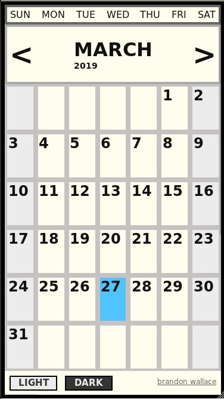
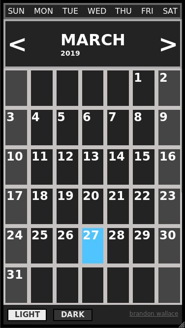

# A mobile first, responsive online Javascript calendar.

# Created using Javascript ES6, HTML5, and CSS3.

# Website: [https://brandon-wallace.github.io/javascript-calendar](https://brandon-wallace.github.io/javascript-calendar)

# Features:
 * Mobile First
 * Responsive Design
 * Javascript ES6
 * HTML5
 * CSS3

# License:

This project is licensed under the GPL-3.0 License.
